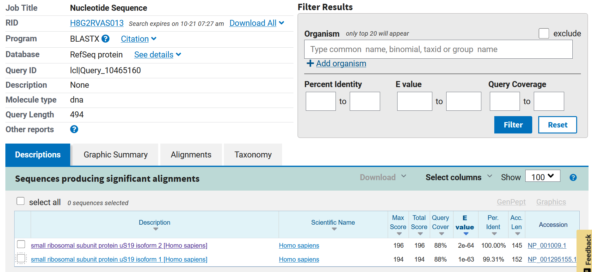

Agenda for meeting on 19th October:

1) ~~Set up the project github tomorrow; update the lab notebook as we discuss.~~

2) ~~Go through Longbow (I'll explain what exists) and various models; either try everything or try something. Should be 20 total options, we can figure out which one is right.~~

What the paper uses is 
DATA-MAS-Revio-PBMC-2     : MAS-Seq kit, Revio, PBMC, 10x 3' kit

Doesn't have circular consensus sequence (ccs)? I think we can stick with what we're using : Ask jason. I don't think nanoranger would be good too.

|Dataset|Suggested model|What we refer to this data as|
| ---- | ---- | ---|
| Varsheni : DATA-Revio-Kinnex-PBMC-10x3p : Kinnex kit, Revio, PBMC, 10x 3' kit | mas_16+sc_10x3p |PBMC 10x3p|
| Shayal : DATA-Revio-Kinnex-HG002-10x5p: Kinnex kit, Revio, HG002, 10x 5' kit | mas_16+sc_10x5p |HG002 10x5p|
| Evan : DATA-Revio-Kinnex-PBMC-10x5p : Kinnex kit, Revio, PBMC, 10x 5' kit | mas_16+sc_10x5p |PBMC 10x5p|

We can compare our data with the bam from the segmented reads folder.

 **WE ARE RUNNING ON THE COMPLETE DATASET**

> What we do need to read is MAS-Seq paper methods.

**The dataset and results on the website data (https://downloads.pacbcloud.com/public/dataset/MAS-Seq/) use skera we can check if longbow can recreate that- new goal.**

3) ~~Create a shorter dataset (to find out if longbow is actually working as intended using samtools as Justin described) to run to completion.~~

4) Understand custom models; try to build one. Look at the spike-in data.

5) Discuss the paper and finish up the table together. (could start it and add on our own as we read)


# Downloading Longbow onto talapas using singularity

```bash
singularity build docker://us.gcr.io/broad-dsp-lrma/lr-longbow:0.6.14
```

# Running Longbow on datasets

run script_singularity_run.sh : this refers to the script_longbow_for_shell.sh

We need 2 scripts to refer to the desired commands once inside singularity container.

Annotate - what's UMIs, what's CBCs,

segmentation - breaking sequence apart

-m: model to use

-o: output file

chmod the bash scripts before running them 

# We're checking whats the deal with the missing UMI/CBC 

Does rerunning get rid of the error? still not sure

We've found that rerunning it causes nothing to be written into the file.
We should always output the data into a new file; not a pre-existing file otherwise it leads to an error.

# Samtools to make smaller datasets

samtools is in bgmp_star and in the singularity image.

conda activate bgmp_star / singularity shell lr-longbow_0.6.14.sif

## Actual command

```
samtools view -h  <full-file> | head -10000 | samtools view -bS > truncated_<file>.bam 
```

to view truncated file:
$ samtools view  <file-name> | less

eg:

samtools view  truncated_PBMC_10x3p.bam | wc -l
9993

# Creating truncated bam index file

```
samtools index <truncated bam file-name>
```

REMEMBER index files (.bai) created by SAMtools can be used, we don't need to use the .pbi files from PacBio

Then, we don't even need to rename .bai to .pbi file because longbow still recognizes it.

For later, if we need to use this we can use SMRTlink instead [as described here](https://www.pacb.com/wp-content/uploads/SMRT_Tools_Reference_Guide_v700.pdf) using the ```pbindex``` tool.

# Running on shell in interactive node 

```
singularity shell lr-longbow_0.6.14.sif 
longbow annotate -m mas_16+sc_10x3p m84014_240128_083549_s3.hifi_reads.bcM0003.bam |  longbow filter -m mas_16+sc_10x3p | longbow segment -m mas_16+sc_10x3p | longbow extract -m mas_16+sc_10x3p -o woohoo_passed.bam
```

# We ran the test on the 3 datasets

|TEST FILE (first 10k lines)|ORIGINAL NUMBER OF READS|ANNOTATED READS|READS PASSING FILTER|FINAL NUMBER OF SEGEMENTED READS|x16?|MAS-seq gain factor|
|-----|-----|-----|-------|-----|----|----|
|truncated_PBMC_10x3p|9993|9992|9802 (98.0985%) |154733|Yes (x15.48)|15.96x|
|truncated_HG002_10x5p|9993|9985|9913 (99.2789%)|154410|Yes (x15.45)|15.66x|
|truncated_PMBC_10x5p|9993|9984|9924 (99.3990%)|152594|Yes (x15.27)|15.46x|


# Using maximum resources on an interactive node what the console looks like

**Truncated HG002_10x5p output (CPUs = 48, MEM = 200G):**

```bash
Progress: 100%|███████████████████████████████████████████████████████████████████████████████████| 9993/9993 [03:24<00:00, 48.76 read/s]
[INFO 2024-10-19 15:49:54 annotate] Annotated 9985 reads with 1268020 total sections.
[INFO 2024-10-19 15:49:54 annotate] Done. Elapsed time: 205.42s. Overall processing rate: 48.61 reads/s.
[INFO 2024-10-19 15:49:54   filter] Done. Elapsed time: 205.6817s.
[INFO 2024-10-19 15:49:54   filter] Total Reads Processed: 9985
[INFO 2024-10-19 15:49:54   filter] # Reads Passing Model Filter: 9913/9985 (99.2789%)
[INFO 2024-10-19 15:49:54   filter] # Reads Failing Model Filter: 72/9985 (0.7211%)
[INFO 2024-10-19 15:49:54   filter] Total # correctly ordered key adapters in passing reads: 164579
[INFO 2024-10-19 15:49:54   filter] Total # correctly ordered key adapters in failing reads: 492
[INFO 2024-10-19 15:49:54   filter] Avg # correctly ordered key adapters per passing read: 16.6023 [17]
[INFO 2024-10-19 15:49:54   filter] Avg # correctly ordered key adapters per failing read: 0.0496 [17]
[INFO 2024-10-19 15:49:54  segment] Segmented 9913 reads with 155217 total segments.
[INFO 2024-10-19 15:49:54  segment] MAS-seq gain factor: 15.66x
[INFO 2024-10-19 15:49:54  segment] Done. Elapsed time: 205.75s.
[INFO 2024-10-19 15:49:54  extract] Done. Elapsed time: 206.04s.
[INFO 2024-10-19 15:49:54  extract] Total # Reads Processed: 154417
[INFO 2024-10-19 15:49:54  extract] # Reads Containing Extracted Segments: 154410/154417 (99.9955%)
[INFO 2024-10-19 15:49:54  extract] Total # Segments Extracted: 154410
[INFO 2024-10-19 15:49:54  extract] Total # Segments Skipped: 7
[INFO 2024-10-19 15:49:54  extract] # Segments extracted per read: 1.00
```


# BLAST CONFIRMATION

go into output file, 10th column is the sequencene

Copy and go to NCBI Blast



It looks good; we can discern up to isoform resolution

# Run completed for Varsheni (PBMC 10x3p)

It took 3.29 days for the run to complete. 

```
[INFO 2024-10-20 03:56:37  segment] Segmented 8717702 reads with 138791391 total segments.
[INFO 2024-10-20 03:56:37  segment] MAS-seq gain factor: 15.92x
[INFO 2024-10-20 03:56:37  segment] Done. Elapsed time: 284019.89s.
[INFO 2024-10-20 03:56:37  extract] Done. Elapsed time: 284020.05s.
[INFO 2024-10-20 03:56:37  extract] Total # Reads Processed: 137392261
[INFO 2024-10-20 03:56:37  extract] # Reads Containing Extracted Segments: 137368986/137392261 (99.9831%)
[INFO 2024-10-20 03:56:37  extract] Total # Segments Extracted: 137368986
[INFO 2024-10-20 03:56:37  extract] Total # Segments Skipped: 23275
[INFO 2024-10-20 03:56:37  extract] # Segments extracted per read: 1.00
```

wget the original segmented files using Skera

```
wget https://downloads.pacbcloud.com/public/dataset/MAS-Seq/DATA-Revio-Kinnex-PBMC-10x3p/1-Sreads/segmented.bam
```

Saved as output_skera_PBMC_10x3p.bam

Comparison of Skera run (from website) vs Longbow run

The Skera (as far as I can see) has not been filtered yet in this dataset.

|File name|Size of File|Number of reads|Length of reads range (10k) |Matching sequences (10k) |Total sequences (10k,filtered >78bp)| %match |
|-|-|-|-|-|-|-|
|output_PBMC_10x3p.bam|68G|137,368,986|5-3772|9561|9927|96.3%|
|output_skera_PBMC_10x3p.bam|74G|141,045,827|78-3884|9561|10000|95.6%|

### Commands used

sed -r '/^.{,78}$/d' sequence_output_PBMC_10x3p.txt | awk '{print
 length}' | sort -n | uniq -c |  head

grep -f <longbow output sequence list> <skera output sequence list>

###### saved subsetted sequence_output_pbmc file as subset_sequence_output_PBMC_10x3p.txt


samtools view  output_skera_PBMC_10x3p.bam | cut -f 10 > skera_sequences.txt
samtools view  output_PBMC_10x3p.bam | cut -f 10 > longbow_sequences.txt
grep -f longbow_sequences.txt skera_sequences.txt 

